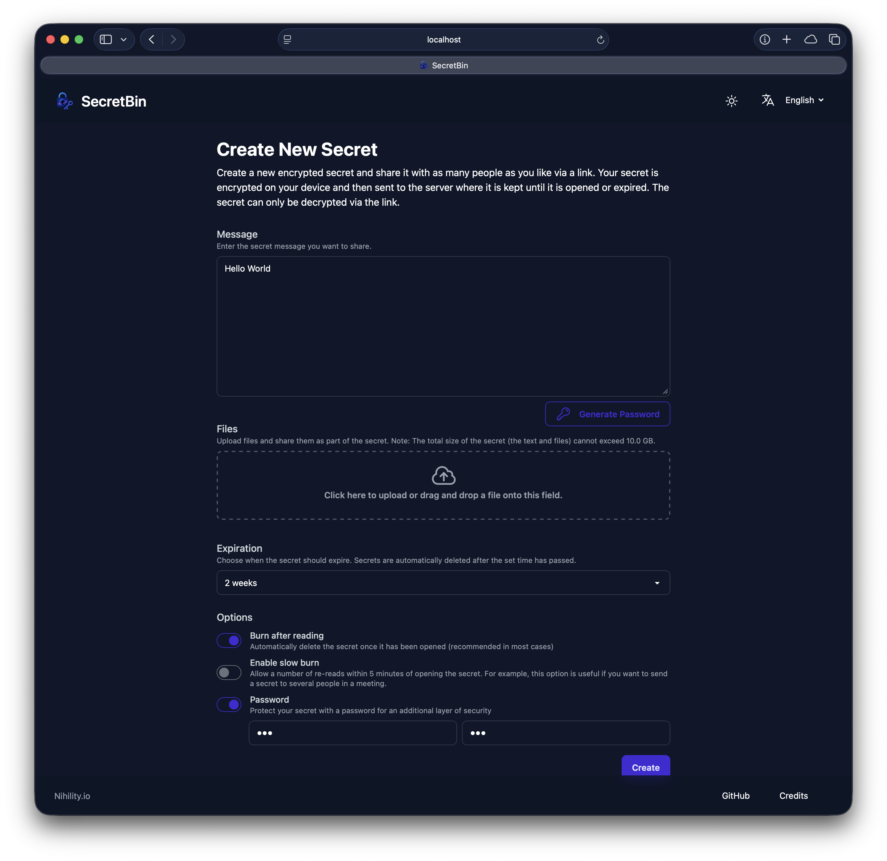
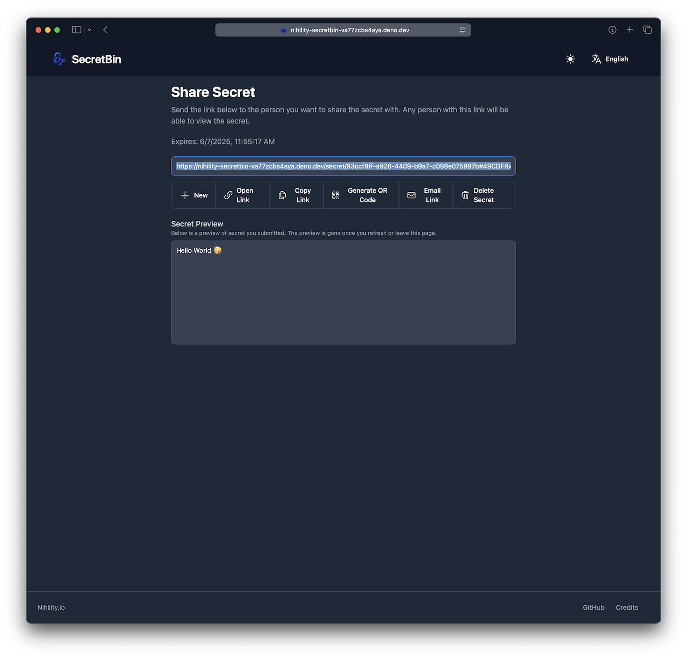
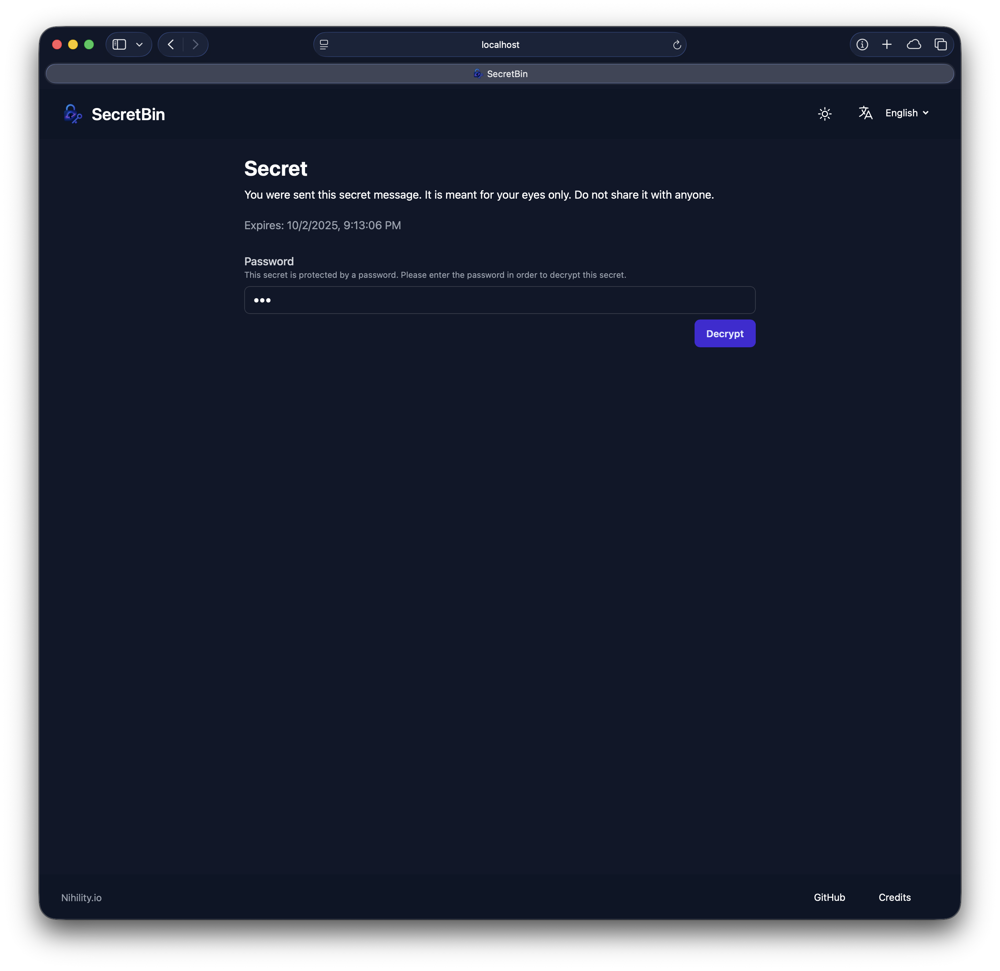
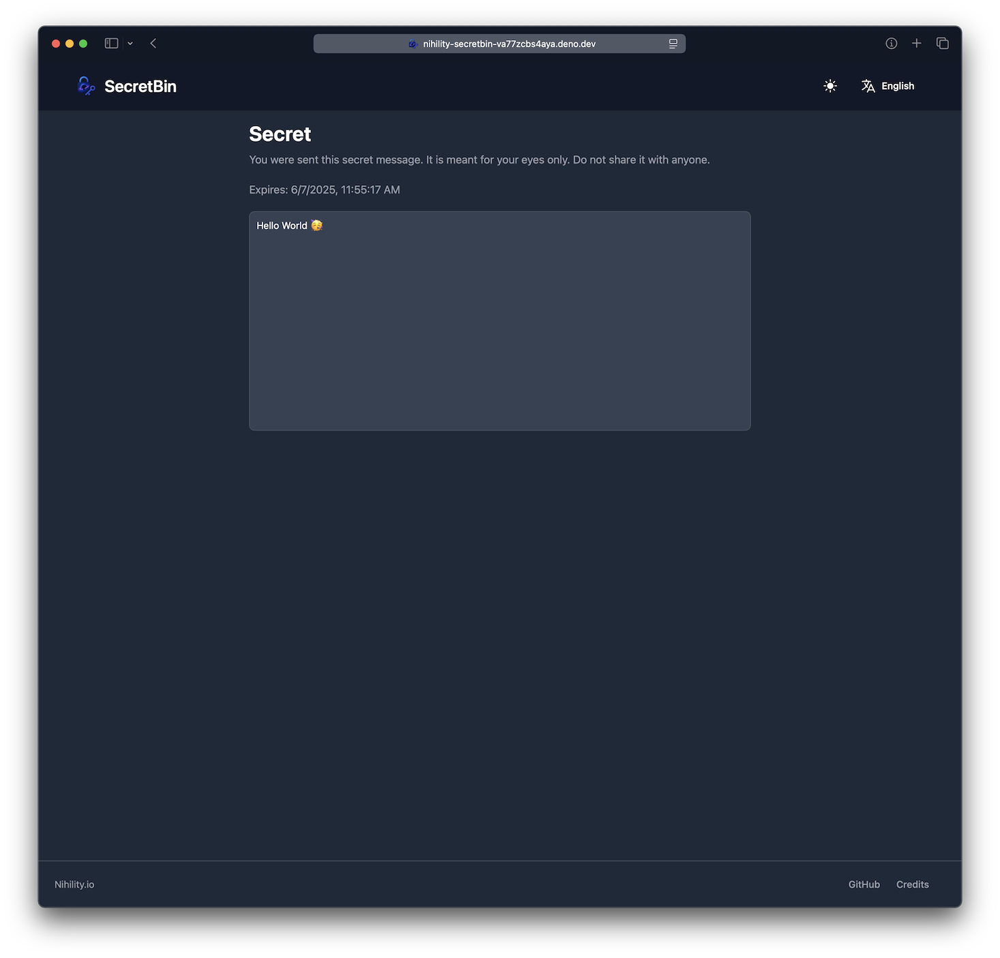
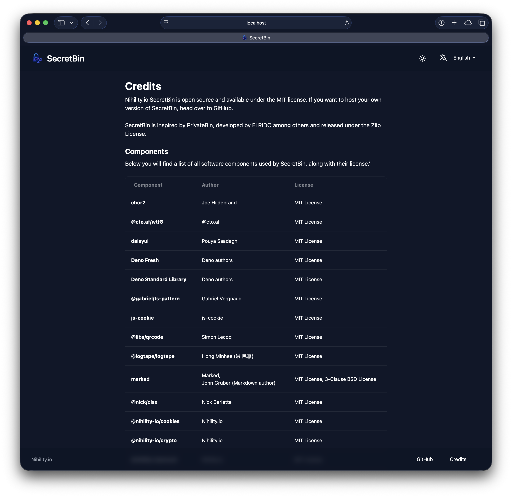

# SecretBin

SecretBin is a web app for sharing secrets like tokens and passwords.

You can use SecretBin to create encrypted secrets and share them with as many people as you like via a link. Your secrets are encrypted on your device and then sent to the server where they are kept until they are opened or expired. The secrets can only be decrypted via the link.

It is inspired by [PrivateBin](https://privatebin.info) PrivateBin is developed by [El RIDO](https://github.com/PrivateBin/PrivateBin/graphs/contributors) among others and released under the [Zlib License](https://github.com/PrivateBin/PrivateBin/blob/master/LICENSE.md).

SecretBin has been completely redeveloped and combines the basic functionality of PrivateBin with useful extensions.

## How Does It Work?

When you open SecretBin you are presented with form that allows you to submit a new secret. Any text and or file can make up a secret. Just add the text and or files and change the security options if you like.

You may choose when the secret should expire. And yes all secrets must expire and one point. SecretBin is a tool for securely sharing information. Its not a storage service.

If you want to you may also choose if your secret should self-destruct after someone reads it. I highly recommend setting this option and here is why:
Imagine you have created a secret and want to share it with someone via e.g. email. If you haven't set a password, anyone can open the secret using the link. If the email account you're sending the secret to has been compromised, a malicious actor way obtain the secret by opening the link themselves. But at the very least the original recipient of the link will notice that someone had access to the link, since they can no longer open it. Now you can act accordingly and e.g. change the token you wanted to send.

### Technical Workflow

1. User A enters all the information for the secret (text, attached files and options).
2. Generate a base key and encrypt secret in the browser (see [Encryption](#encryption))
3. Send the encryption secret (excluding the base key) to the SecretBin server which stores it in a database.
4. The server returns the ID of the stored secret.
5. Create a link using the secret ID and the base key in the following format: https://&lt;server&gt;/secret/&lt;id&gt;#encodeBase58(base key)
   - Note: The important bit is the **#**. The part after the **#** is called an [URI fragment](https://en.wikipedia.org/wiki/URI_fragment). Fragments are a special part of the URL which is not sent to web server with the request. This is important because we don't want SecretBin's server to know the key, otherwise the server would be able to decrypt the secret, which defeats the purpose.
6. User A sends the link to User B.
7. User B opens the link.
8. The browser requests the secret's metadata (excluding the encrypted data) from SecretBin's server.
9. The browser uses the metadata to determine if the link self-destructs (burns) or requires a password. If the link burns the user is prompted to confirm that they will not be able to view the secret again. If the link requires a password, the user is be prompted to enter it.
10. The browser requests the actual secret. If the link burn this will also result in the secret being deleted from the server.
11. The browser decrypts the secret using the base key (the URI fragment) and password.
12. User B can see the secret text and or files.

### Encryption

1. Generate random binary data using [Web Crypto's getRandomValues](https://developer.mozilla.org/en-US/docs/Web/API/Crypto/getRandomValues)
   - baseKey := A 256 bit base key
   - iv := A 128 bit initialization vector
   - salt := A 64 bit salt
2. Generate a encryption key with [PBKDF2](https://en.wikipedia.org/wiki/PBKDF2) using [Web Crypto's getRandomValues](https://developer.mozilla.org/en-US/docs/Web/API/SubtleCrypto/deriveKey)
   - key := PBKDF2(base Key + password, salt, 100000 iterations, SHA-256)
3. Encrypt the secret with **AES256-GCM** using [Web Crypto's encrypt](https://developer.mozilla.org/en-US/docs/Web/API/SubtleCrypto/encrypt)
   - enc := AES256-GCM(secret, baseKey, iv, adata: []) # _adata is not used, so leave it empty_

## How Can I Use This App?

Unfortunately, I only develop the app. I do not host it myself. Why? I am a developer and not a lawyer. Since I operate from the EU, SecretBin would need a privacy policy in order to operate it. I don't know how to write one and I can't be bothered to pay someone to do it.

That being said, it you want to build and host SecretBin yourself, you can. Just pull the source code and run it using Deno (see [Getting Started](#getting-started)). You can even easily brand SecretBin with a new name if you want. SecretBin is licensed under the (MIT License)[https://www.tldrlegal.com/license/mit-license], so do it what you want. You might as well sell it if you want. I don't care, as long as it is within the license.

## Getting Started

### Building

1. Download and install [Deno](https://deno.com).
2. Install git e.g. using:
   ```bash
   sudo apt install git
   ```
3. Clone the repository using:
   ```bash
   git clone https://github.com/Nihility-io/SecretBin.git
   ```
4. Change into the cloned repository (`cd SecretBin`) and build SecretBin using:
   ```bash
   deno task compile
   ```
5. And there you go. You will find an executable called SecretBin or SecretBin.exe in the current folder. Copy it to where ever you want to use it. And run it.

### Configuration

In case you want to configure SecretBin, just place a config.yaml in the same folder as the executable. SecretBin has the following configuration options:

```yaml
branding:
  appName: SecretBin # Changes the app in all places including but not limited to the title bar
  footer: Nihility.io # Text shown in the footer on the left side e.g. the name of the service hoster
  links: # Custom link shown in the footer on the right 
  - link: https://github.com/Nihility-io/SecretBin # URL
    name: #Localized display text
      en: GitHub
      de: GitHub
  showLogo: true # If set the true, the app logo is shown before the app name in the navigation bar
  showTerms: true #Sets if the ToS window should be shown when a user fist visits the app
  terms: # ToS Dialog show when the user first visits the app
    title:
      en: Terms of Service
      de: Nutzungsbedingungen
    content: # Text that may contain HTML 
      en: "..."
      de: "..."
banner:
  en: Hello World!
  de: Hallo Welt!
defaults: # Just customizable defaults 
  expires: 2w # Default expire time when creating a new secret
  burn: true # Default burn selection
policy:
  sharePreselect: true # Pre-selects the link in the share view
  requirePassword: false # Forces users to enable the burn option for new secrets
  requireBurn: false # Forces users to specify a password for new secrets
  denySlowBurn: false # Blocks users from enabling slow burn for new secrets
storage:
  maxSize: 10Mi # Max size a new secret is allowed to have
  gcInterval: 5 # Interval in seconds in which the garbage collector should run
  backend: # Use Deno KV as a backend
    type: kv
  backend: # Use PostgreSQL as a backend
    type: postgres
    host: 127.0.0.1
    port: 5432
    database: secretbin
    username: secretbin
    password: abc123
expires: #Expire options for new secrets
  - 5min
  - 1hr
  - 1d
  - 1w
  - 2w
  - 1m
```

## Screenshots

### Create a new secret



### Share the created secret



### Open the secret and confirm that you want to read it


### Enter the password for the secret



### Read the secret



### Credits


